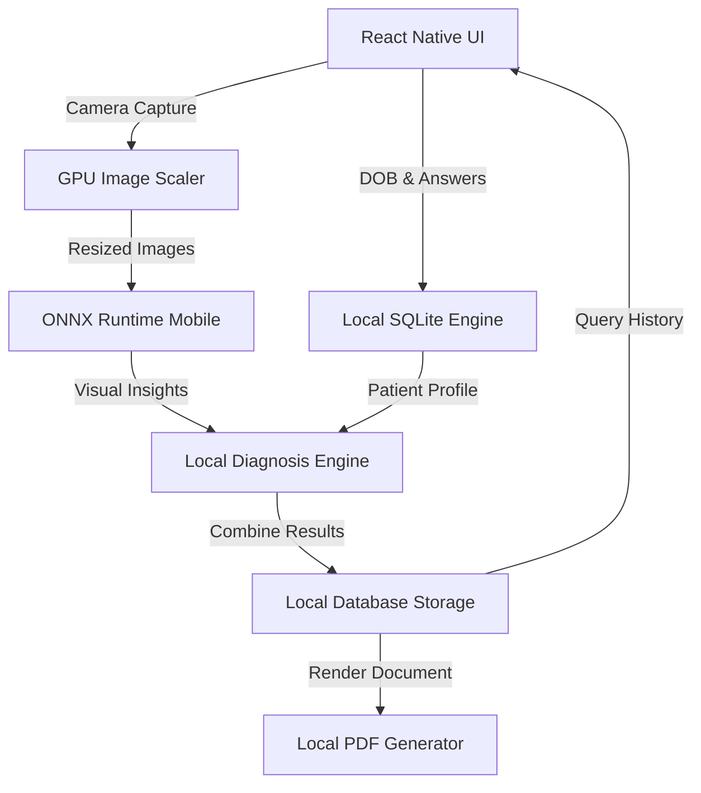

# Blueprint: Offline-First Local AI Mental Health Scanner (React Native)

This document provides a comprehensive technical specification to build a completely offline-first, local AI-powered mobile application in **React Native** that ports the Laravel-based visual and questionnaire screening capabilities. The app does not require a backend or user registration, handling all database storage, image processing, and AI visual inference directly on the mobile device.

---

## 1. System Architecture



### Key Highlights
* **Zero APIs & Internet Requirement**: Fully offline execution.
* **No Authentication**: Data belongs exclusively to the physical device.
* **On-Device AI Inference**: Uses a quantized version of PaliGemma/Gemma Vision running on the phone's GPU/NPU.
* **Clinical PDF compilation**: Generated on-device from a local HTML layout.

---

## 2. On-Device Local AI Engine

To process the face, eyes, and nails photos offline, the mobile app uses **ONNX Runtime Mobile** loaded with a quantized vision model.

### 2.1 Model Selection & Quantization
* **Model**: **PaliGemma-3B-pt-4bit** (or **MobileNetV4** / **EfficientNet-Lite** for specific visual features + **Gemma-2B-IT** for combined analysis).
* **Quantization**: Convert the model to **ONNX format** with **INT4 (4-bit integer) quantization** using Hugging Face's `optimum` library. This reduces model size from ~6GB to **~1.8GB**, enabling execution on phones with ≥6GB RAM.
* **Runtime**: Integrate `@onnxruntime/react-native` to access NNAPI (Android) and CoreML (iOS) for hardware NPU acceleration.

### 2.2 Execution Pipeline

1. **Camera Input**: Capture high-res photos.
2. **GPU Scaling**: Crop and scale the photos to the model's required input dimensions (typically `224x224` or `448x448`) using native canvas scaling to prevent UI freezes.
3. **Tensor Input**: Convert the scaled image into a Float32 multi-dimensional array (RGB normalization `[0.0, 1.0]` or standard ImageNet normalizations).
4. **Local Inference Run**:
   ```typescript
   import { InferenceSession, Tensor } from 'onnxruntime-react-native';

   // Load model from assets (lazy loaded to save RAM)
   const session = await InferenceSession.create('assets/models/paligemma_int4.onnx');
   
   // Feed Tensor and execute
   const feeds = { input_image: imageTensor };
   const results = await session.run(feeds);
   ```

---

## 3. Local Relational Storage (SQLite)

All history records are saved in a local relational database using `expo-sqlite` or `react-native-quick-sqlite`.

### 3.1 Database Schema
```sql
CREATE TABLE IF NOT EXISTS patients (
    id INTEGER PRIMARY KEY AUTOINCREMENT,
    nama_pasien TEXT NOT NULL,
    tanggal_lahir DATE NOT NULL,
    jenis_kelamin TEXT CHECK(jenis_kelamin IN ('L', 'P')) NOT NULL,
    created_at TIMESTAMP DEFAULT CURRENT_TIMESTAMP
);

CREATE TABLE IF NOT EXISTS screening_sessions (
    id INTEGER PRIMARY KEY AUTOINCREMENT,
    patient_id INTEGER NOT NULL,
    usia_tahun INTEGER,
    usia_bulan INTEGER,
    foto_muka_path TEXT,
    foto_mata_path TEXT,
    foto_kuku_path TEXT,
    analisis_muka TEXT,
    analisis_mata TEXT,
    analisis_kuku TEXT,
    jawaban_kuesioner TEXT, -- JSON Stringified
    analisis_gabungan TEXT,
    rekomendasi TEXT,
    level_risiko TEXT CHECK(level_risiko IN ('rendah', 'sedang', 'tinggi')),
    sesi_tipe TEXT DEFAULT 'awal',
    sesi_sebelumnya_id INTEGER,
    status_perbandingan TEXT, -- 'membaik' | 'belum_membaik' | 'memburuk'
    created_at TIMESTAMP DEFAULT CURRENT_TIMESTAMP,
    FOREIGN KEY(patient_id) REFERENCES patients(id) ON DELETE CASCADE,
    FOREIGN KEY(sesi_sebelumnya_id) REFERENCES screening_sessions(id) ON DELETE SET NULL
);
```

### 3.2 Scoping & History Retrieval
* Scoping by user account is unnecessary because the local SQLite database resides entirely inside the app's sandboxed storage. The user only sees their own data.
* Admin views can be simulated as a "Developer Panel" or "Export Database" feature.

---

## 4. Technical Feature Specifications

### 4.1 DOB Picker & Precise Age Calculation
To determine whether to display the Balita (Toddler), Prasekolah (Preschool), Anak Sekolah (School Age), or Remaja (Teens) questionnaire:
```javascript
function calculateAge(dobString) {
    const dob = new Date(dobString);
    const today = new Date();
    
    let years = today.getFullYear() - dob.getFullYear();
    let months = today.getMonth() - dob.getMonth();
    
    if (months < 0 || (months === 0 && today.getDate() < dob.getDate())) {
        years--;
        months = 12 + months;
    }
    
    // Adjust month if day is not reached
    if (today.getDate() < dob.getDate()) {
        months--;
    }
    
    return { years, months };
}
```

### 4.2 Questionnaire Selection Rules
* **0 - 2 Tahun**: Toddler questionnaire (observed behavior by parent).
* **3 - 5 Tahun**: Preschool questionnaire (behavior/expression observed by parent).
* **6 - 12 Tahun**: School Age questionnaire.
* **>12 Tahun**: Teenager / Adult self-assessment.
* *Note: Column 7 is always present as an optional free-text textarea for custom parental notes.*

### 4.3 GPU-Accelerated Image Compression
To prevent Out of Memory (OOM) crashes when processing large photos, compress and resize them immediately on the camera background thread:
```typescript
import * as ImageManipulator from 'expo-image-manipulator';

const compressImage = async (uri: string) => {
    return await ImageManipulator.manipulateAsync(
        uri,
        [{ resize: { width: 500 } }], // Compress width to 500px while retaining aspect ratio
        { compress: 0.8, format: ImageManipulator.SaveFormat.JPEG }
    );
};
```

### 4.4 Local PDF Report Generation
Generate clinical-grade reports locally using HTML layouts converted directly to a PDF document:
```typescript
import * as Print from 'expo-print';
import * as Sharing from 'expo-sharing';

const generateLocalPdf = async (scanData, patient) => {
    const htmlContent = `
        <html>
            <head>
                <style>
                    body { font-family: 'Helvetica', sans-serif; color: #1e293b; padding: 20px; }
                    .header { border-bottom: 2px solid #6366f1; padding-bottom: 15px; }
                    .title { font-size: 22px; font-weight: bold; color: #4338ca; }
                    .table { width: 100%; border-collapse: collapse; margin-top: 20px; }
                    .table th, .table td { border: 1px solid #cbd5e1; padding: 10px; font-size: 12px; }
                    .badge { padding: 4px 8px; border-radius: 4px; font-weight: bold; }
                    .badge-tinggi { background: #fee2e2; color: #ef4444; }
                </style>
            </head>
            <body>
                <div class="header">
                    <div class="title">LAPORAN MEDIS KESEHATAN MENTAL ANAK</div>
                    <p>ID Pemeriksaan: #MS-${scanData.id}</p>
                </div>
                <h3>Profil Pasien</h3>
                <p>Nama: ${patient.nama_pasien}</p>
                <p>Usia: ${scanData.usia_tahun} Tahun ${scanData.usia_bulan} Bulan</p>
                
                <h3>Hasil Deteksi</h3>
                <table class="table">
                    <tr><th>Parameter</th><th>Kondisi</th></tr>
                    <tr><td>Tingkat Risiko</td><td><span class="badge badge-${scanData.level_risiko}">${scanData.level_risiko.toUpperCase()}</span></td></tr>
                    <tr><td>Analisis AI</td><td>${scanData.analisis_gabungan}</td></tr>
                    <tr><td>Rekomendasi Tindakan</td><td>${scanData.rekomendasi}</td></tr>
                </table>
            </body>
        </html>
    `;

    const { uri } = await Print.printToFileAsync({ html: htmlContent });
    await Sharing.shareAsync(uri);
};
```

---

## 5. Offline Edge Cases & Mitigation Strategies

| Edge Case | Risk | Mitigation Strategy |
| :--- | :--- | :--- |
| **Out of Memory (OOM)** | Model file is too large for devices with low RAM (e.g. 4GB RAM). | Use INT4 quantization. Terminate the inference session immediately after results are generated to free up memory: `session.release()`. |
| **No NPU Support** | Local inference becomes extremely slow on older CPUs. | Set the ONNX execution provider to fallback automatically: `providers: ['nnapi', 'cpu']`. Display a loading indicator explaining "Memproses gambar secara lokal..." |
| **Large App Bundle Size** | Shipping a 1.8GB model in the APK makes download sizes too large. | Implement **On-Demand Loading**: Ship the app with a lightweight shell and download the ONNX model file from a secure bucket on the first app launch, saving it to `FileSystem.documentDirectory`. |
| **Camera Orientation Shifting** | Image rotation causes AI to misidentify nails, face, or eyes. | Capture photo metadata using EXIF tags to normalize image orientation (using `ImageManipulator` rotation options) before sending it to the tensor translator. |
